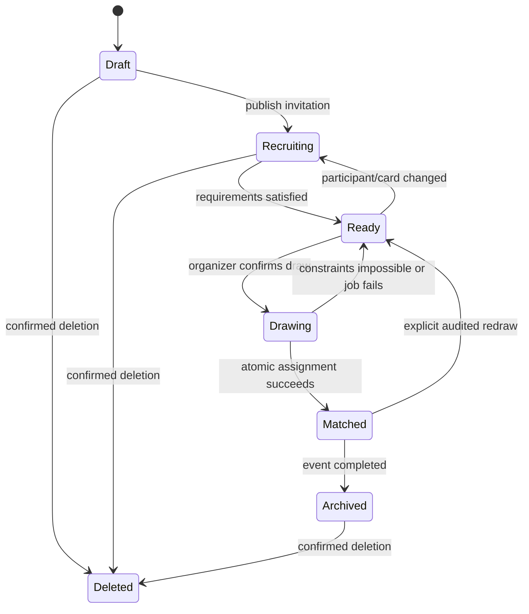

# Product specification

## 1. Product vision

Secret Santa is a year-round service for organizing anonymous gift exchanges. It supports New Year games as the primary scenario and reusable event templates for birthdays, weddings, graduations, corporate events, school events, and arbitrary occasions.

The product must make a small private exchange easy while still giving an organizer enough control for a large group. Personal data, draw results, and private wishes are never exposed outside the people who need them.

Related documents:

- [Architecture](architecture.md)
- [UX and visual design](ui-mockups.md)
- [Draw engine rules](draw-engine.md)
- [Security and personal data](security-privacy.md)
- [Delivery roadmap](roadmap.md)
- [Product decisions](decisions.md)
- [Reference-site audit](research/santa-secret-page-audit.md)

## 2. Product principles

1. **Private by default.** A participant sees only their own card and, after the draw, their recipient.
2. **Organizer control without accidental disclosure.** Organizer-only diagnostics and assignment tables are protected by explicit permissions and reveal warnings.
3. **A useful basic flow without payment.** Creating a box, inviting participants, drawing assignments, and receiving the result remain available in the free product.
4. **One clear action per state.** Every box screen identifies the next blocking action: complete a card, invite people, lock participants, run the draw, or send a reminder.
5. **Reversible setup, controlled irreversible actions.** Configuration can be edited before the draw. Archive, delete, redraw, and result disclosure require explicit confirmation.
6. **Seasonal, not Christmas-only.** Copy and imagery adapt to the event type without changing the core interaction model.

## 3. Roles and permissions

### Guest

- browse the public pages, FAQ, privacy notice, and support page;
- run a quick draw;
- open an invitation link and create or attach an account;
- cannot inspect other participants' private data.

### Participant

- maintain their card, wishes, wishlist, address, phone, and notification preferences;
- see the public participant list only when the organizer enabled it;
- after the draw, see only their recipient and communicate through the anonymous channel;
- mark gift preparation and delivery states without revealing the assignment.

### Organizer

- create and configure a box;
- invite, remind, remove, lock, or manually add participants before the draw;
- configure exclusions and validate whether a draw is possible;
- run the draw and inspect delivery/readiness status;
- access the assignment table only through an explicit organizer action;
- archive or delete a box.

### Administrator

- handle abuse, delivery failures, user deletion, and support requests;
- cannot casually browse assignment or address data; privileged access is audited.

## 4. Core domain

The UI calls an exchange a **box**. The backend may keep `Box` as the aggregate name; event type and seasonal presentation are properties of the box.

### Box

- title, description, slug, event type, event date, signup and shipping deadlines;
- public or invite-only access;
- cover image/icon and seasonal theme;
- currency and optional minimum/maximum gift budget;
- switches for wishes, wishlist, postal address, phone, and participant-name visibility;
- draw mode and exclusion policy;
- lifecycle status.

### Participant

- optional account link, display name, email, invitation status, and card readiness;
- wishes, structured wishlist, address, phone, and notification preferences;
- organizer flag and participation history;
- sensitive fields have independent visibility rules.

### Draw

- immutable assignment set for one draw revision;
- constraint snapshot, algorithm version, seed commitment, timestamps, and actor;
- delivery and notification state are stored separately from the assignment itself;
- redraw creates a new audited revision instead of editing individual pairs silently.

### Supporting entities

- `EmailInvite`, `InviteToken`, `DrawExclusion`, `WishlistItem`, `AnonymousMessage`;
- `EventTemplate`, `Notification`, `DeliveryStatus`, `GiftFeedback`;
- `AuditEvent`, `ConsentRecord`, and deletion/scrubbing jobs.

## 5. Box lifecycle

The system must calculate and display readiness blockers. Examples: fewer than three participants, missing required cards, duplicate email, impossible exclusion graph, or invitations still awaiting a configured deadline.

## 6. Main user journeys

### 6.1 Create a box

The organizer completes a five-step wizard:

1. title, unique URL slug, event type, description, and dates;
2. optional budget range and currency;
3. required participant fields and name-visibility policy;
4. draw rules and exclusions;
5. cover/theme, review, and creation.

Autosave every completed step. A user may leave and resume without losing the draft. Validate the slug, budget range, deadlines, and draw constraints before publishing.

### 6.2 Invite and prepare participants

- share a revocable invitation link;
- enter one or many name/email rows;
- optionally send invitations immediately;
- show `invited`, `opened`, `joined`, `card incomplete`, and `ready` states;
- provide per-person and bulk reminders;
- let the organizer create their own card from the same screen.

### 6.3 Participant card

- display name or pseudonym;
- free-form wishes and structured wishlist items;
- optional sizes, dislikes, allergies, and do-not-gift notes;
- postal address and phone only when required by the box;
- field-level explanation of who can see each value;
- preview of the card as the future Santa will see it.

### 6.4 Run and reveal a draw

- validate all hard constraints before confirmation;
- show the number of participants and exclusions without previewing pairs;
- execute once in a transaction and make retries idempotent;
- notify each participant through a one-time or authenticated result link;
- keep the organizer's assignment table behind a separate warning screen;
- record all disclosure, redraw, and manual-override events.

### 6.5 Quick draw

Quick draw supports a one-off exchange without a persistent box:

- 3-100 participants with name and email;
- optional organizer participation;
- no wishlist, address tracking, delivery workflow, or organizer assignment table;
- validate duplicate emails and self-assignment;
- send private results immediately and provide a recovery path for failed email.

### 6.6 After the draw

- recipient card with wishes, address, budget, and anonymous chat;
- participant-controlled statuses: seen, choosing, purchased, sent, delivered;
- organizer sees aggregate status, not private message contents;
- reminders for unread assignments and shipping deadlines;
- optional gift feedback and gallery only with explicit consent.

## 7. Functional requirements

### Authentication and profile

- email/password authentication with access and refresh sessions;
- optional Google, VK, and Telegram account linking;
- notification preferences for email, VK, and Telegram;
- email change verification, password change, session management, and account deletion;
- profile deletion blocks until owned boxes are transferred/deleted and active commitments are resolved.

### Box management

- active and archived lists with organizer/participant role labels;
- search and filters by status, date, and event type;
- clone a completed box into a new event without copying private participant data;
- archive is read-only; restore is an explicit organizer action;
- deletion requires the exact confirmation phrase and follows the retention policy.

### Draw constraints

- no self-assignment;
- each participant gives to and receives from exactly one person;
- explicit pair exclusions, family/household exclusions, and optional no-repeat history;
- optional prohibition of reciprocal pairs;
- manual assignment is post-MVP and must pass the same validation rules;
- impossible constraint sets return actionable diagnostics.

### Wishlist

- multiple items with title, note, category, priority, price range, and product URL;
- participant can mark an item as unsuitable or remove it before the draw;
- purchased/reserved state must not reveal the Santa;
- external product data is advisory and never required to save an item.

### Communication

- transactional invitation, assignment, reminder, resend, and deadline emails;
- anonymous Santa/recipient messages after the draw;
- report/block controls, rate limits, and moderator escalation;
- delivery status updates without exposing shipment details to other participants.

### Support and public pages

- landing page, how-it-works steps, FAQ, privacy policy, support/contact, resend-email, and project-support/donation page;
- contact flow recommends relevant FAQ articles before opening the message form;
- transactional mail failures can be retried by the user without exposing whether an unrelated email exists.

## 8. API surface

The exact OpenAPI schema is maintained in code. The product requires these resource groups:

- `/auth`, `/sessions`, `/profile`, `/social-accounts`, `/notification-settings`;
- `/boxes`, `/boxes/{id}/settings`, `/boxes/{id}/archive`, `/boxes/{id}/clone`;
- `/boxes/{id}/participants`, `/invitations`, `/invitations/{token}`;
- `/boxes/{id}/draw/validate`, `/boxes/{id}/draw`, `/assignments/me`;
- `/boxes/{id}/exclusions`, `/wishlist-items`, `/anonymous-messages`;
- `/notifications`, `/email/resend`, `/support`, `/consents`, `/account/deletion`.

Mutation endpoints that send mail, run a draw, archive, delete, or redraw must accept an idempotency key.

## 9. Quality requirements

- mobile-first layouts for 360 px and wider, with full keyboard support;
- WCAG 2.2 AA color contrast, focus visibility, labels, and error summaries;
- no participant or assignment data in analytics payloads, URLs, or client logs;
- p95 read API latency below 500 ms excluding external providers;
- background email and draw jobs expose status and retry information;
- deterministic test fixtures cover every draw invariant and impossible graph case;
- Russian is the default locale; English uses the same feature and validation coverage;
- transactional email templates are tested in common mobile and desktop clients.

## 10. Product phases

### MVP

- authentication and profile;
- box wizard and organizer dashboard;
- invitation link/email and participant cards;
- validated basic draw and private results;
- transactional email, resend, and reminders;
- active/archive management, FAQ, contact, privacy, and responsive design.

### Phase 2

- structured wishlists;
- exclusion rules and no-repeat history;
- anonymous messages and delivery states;
- richer notification channels and organizer status reporting.

### Phase 3

- recurring event templates, clone workflow, analytics, gift feedback;
- corporate administration, participant imports, and configurable branding;
- optional recommendation and product integrations.

### Later experiments

- AI gift recommendations based only on participant-provided preferences;
- group gifts and payments;
- time-capsule messages;
- gift gallery, reputation, and social integrations.

These experiments are not MVP commitments and require separate privacy, moderation, and payment reviews.

## 11. Source and provenance

This specification consolidates the product brief uploaded in Chat 68 (`6193f43f.md`, 12,529 UTF-8 bytes) and a manual page audit of `santa-secret.ru` performed in October 2025. The reference service is used to identify expected workflows, not as a source of branding, copy, artwork, or implementation.
