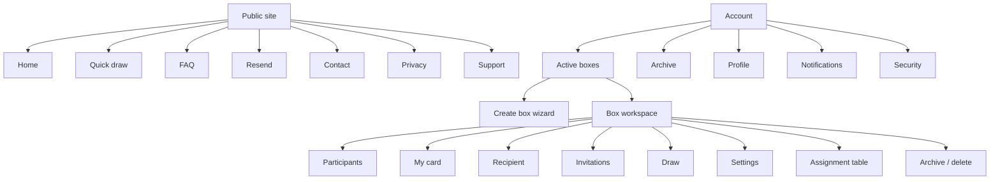

# UX and visual design specification

## Experience goals

The interface should feel festive without becoming a one-season novelty. Operational screens prioritize clarity, readiness, and privacy; seasonal expression comes from real event imagery, cover art, and small accents rather than decorative gradients or oversized cards.

The product has three visual modes built from one system:

1. **Public discovery:** warm, visual, concise, with the event concept visible in the first viewport.
2. **Participant flow:** focused, private, and mobile-first, with one clear next action.
3. **Organizer workspace:** denser, scan-friendly, and status-oriented.

## Brand direction

- Working name: `Secret Santa`; final naming is unresolved.
- Voice: direct, friendly, and calm. Avoid jokes in errors, privacy notices, destructive actions, and delivery incidents.
- Use original photography or generated bitmap illustrations of actual gift exchanges and event types. Do not reuse competitor assets.
- The home hero uses one relevant, inspectable image with overlaid text and leaves the next section visible. It is not a gradient-only or split-card hero.
- Seasonal themes may change media and accents while preserving contrast and component behavior.

## Design tokens

The existing Tailwind configuration establishes the starting palette:

| Token | Value | Use |
| --- | --- | --- |
| `primary` | `#FF4D67` | Primary commands and selected state |
| `primary-dark` | `#D63B52` | Hover/pressed and high-contrast text accents |
| `primary-light` | `#FF7488` | Limited decorative accent, not body text |
| `accent` | `#FFD166` | Highlights and seasonal accents |
| `surface` | `#F7F8FB` | Page background |
| success | `#15803D` | Ready, delivered, completed |
| warning | `#B45309` | Pending, deadline, incomplete |
| danger | `#B91C1C` | Delete, revoked, failed |
| info | `#1D4ED8` | Neutral system information |

Typography remains Manrope for display headings and Inter for interface/body text. Letter spacing stays at `0` except short uppercase metadata where positive tracking is intentional.

### Shape and elevation

- cards and panels: 8 px radius maximum;
- inputs: 6-8 px radius, stable 44 px minimum height;
- icon buttons: square, 40-44 px, tooltip when the icon is not self-evident;
- status chips and avatars may be pill/circular;
- avoid cards nested inside cards; use sections, dividers, and tables inside workspaces;
- shadow is reserved for menus, dialogs, and overlays, not every section.

## Information architecture

## Public pages

### Home

- Header: brand, quick draw, FAQ, account, locale, login/profile.
- Hero: event image, literal product name, one-sentence value, `Create a box`, secondary `Quick draw`.
- Next section visible in the first viewport on mobile and desktop.
- Four-step how-it-works band: create, invite/complete cards, draw, exchange.
- Event-type examples, privacy explanation, FAQ teaser, and compact footer.

### Quick draw

- Compact participant table with add/remove controls and row validation.
- Participant count and 100-person limit are always visible.
- Organizer participation is a checkbox, not a text button.
- Submission displays a confirmation summary before email is sent.
- Success lists delivery status and recovery actions without displaying assignments.

### FAQ, resend, contact, privacy, support

- FAQ uses tabs and an accessible accordion with linkable question anchors.
- Resend explains spam-folder checks and gives a neutral success response.
- Contact starts with suggested FAQ results, then reveals the message form.
- Privacy uses a readable table of contents and version/effective date.
- Support/donation is a separate optional page and never blocks the product.

## Organizer workspace

### Active boxes

- Toolbar: search, status/event filters, view tabs, and `Create box`.
- Repeated rows/cards show title, date, readiness, participant count, role, and next action.
- Desktop may use a table; mobile uses stable stacked rows.
- Empty state links directly to the creation wizard.

### Creation wizard

- Stepper with five named steps and autosave state.
- Back/next commands remain in a stable footer.
- Advanced draw rules are collapsed until requested.
- Review step shows all participant-data fields and who can see them.
- Validation summary links to the exact field that blocks creation.

### Box workspace

Use a restrained tab layout: `Participants`, `My card`, `Recipient`, `Messages`, `Settings`. Organizer-only actions live in an action menu, not mixed into participant navigation.

The header contains:

- box title, event date, status, and cover swatch/image;
- readiness progress such as `8 of 10 cards ready`;
- primary next action;
- overflow menu for invite, draw, assignment table, archive, and delete.

### Participant roster

- Columns: participant, invitation state, card state, delivery channel, last reminder, actions.
- Bulk select and reminder controls appear only when items are selected.
- Sensitive address/phone values are never shown in the roster.
- Use icons with tooltips for resend, copy invite, remove, and more actions.

### Draw confirmation

- Dedicated dialog/page listing participant count, hard constraints, warnings, and irreversibility.
- No potential pairs are previewed.
- Impossible-state diagnostics link back to exclusions or participant readiness.
- After success, show notification delivery progress and a link back to the workspace.

### Assignment table

- Warning screen before first access.
- Table appears only after explicit confirmation and records access.
- Hide addresses, phones, and messages; show only the minimum pair identity.
- Export is a separate permission and post-MVP capability.

## Participant experience

### Invitation

- Explain organizer, event, date, budget, and required fields before acceptance.
- Accepting and completing a card are separate visible steps.
- Existing users can attach the invitation after authentication without losing state.

### My card

- Group identity, wishes, wishlist, delivery, and privacy into separate unframed sections.
- Every sensitive field includes a concise visibility statement.
- Preview mode shows exactly what the assigned Santa will see.
- Completion state distinguishes required errors from optional suggestions.

### Recipient

- Locked state before draw explains when results become available.
- Revealed state shows wishes, wishlist, allowed contact/delivery information, budget, and anonymous message command.
- Gift status is a segmented control or menu, not free text.

## Component inventory

- buttons: primary, secondary, danger, icon, loading, disabled;
- form controls: input, textarea, select, combobox, checkbox, toggle, currency input, date picker;
- navigation: tabs, stepper, sidebar, breadcrumbs, pagination;
- feedback: inline error, error summary, toast, banner, empty state, skeleton;
- data: participant table, box row, status badge, timeline, delivery status;
- overlays: confirmation dialog, action menu, command palette on desktop;
- privacy: visibility hint, sensitive-data reveal, consent checkbox, audit warning.

Use Lucide icons through the application icon library. Do not draw standalone SVG controls when a standard icon exists.

## Responsive behavior

- Target widths: 360, 768, 1024, and 1440 px.
- No horizontal page scroll at 360 px; data tables become labelled rows or offer controlled table scrolling.
- Fixed-format controls use stable dimensions so loading and status text cannot shift layout.
- Header navigation collapses to an accessible menu; primary event actions remain reachable.
- Dialogs become full-height sheets on narrow mobile only when content cannot fit safely.

## Accessibility and content

- WCAG 2.2 AA contrast, visible focus, keyboard operation, and reduced-motion support.
- Inputs always have persistent labels; color is never the only status indicator.
- Errors explain the correction and focus the first invalid field.
- Destructive actions name the object and consequence.
- Dates, currency, plural forms, and names use locale-aware formatting.
- Never display assignments or private participant details in toast previews or browser notifications.

## Design acceptance checklist

- all public and account routes have loading, empty, error, and success states;
- organizer and participant permissions are reflected in both UI and API tests;
- the longest Russian and English labels fit at all target widths;
- screenshots at target widths show no overlaps or clipped actions;
- every icon-only command has an accessible name and tooltip where needed;
- draw, assignment table, archive, delete, and account deletion have distinct confirmations;
- original imagery is licensed and has useful alt text;
- the product remains recognizable outside the New Year season.
